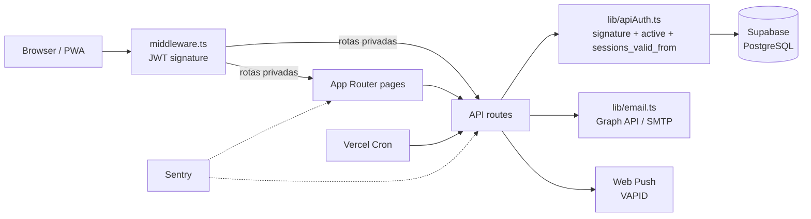
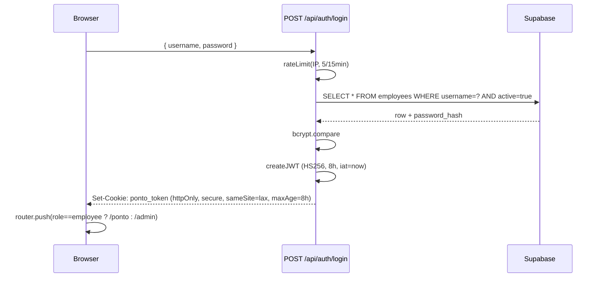
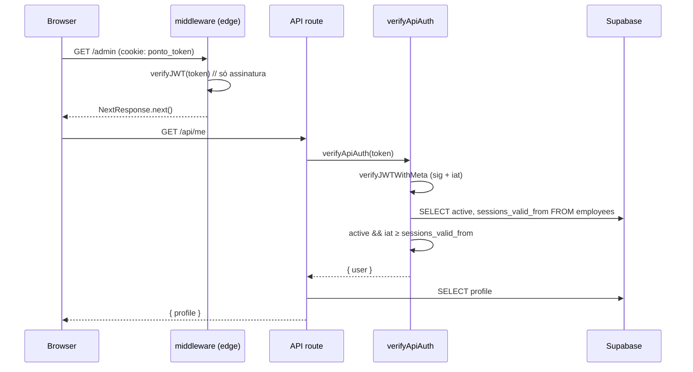
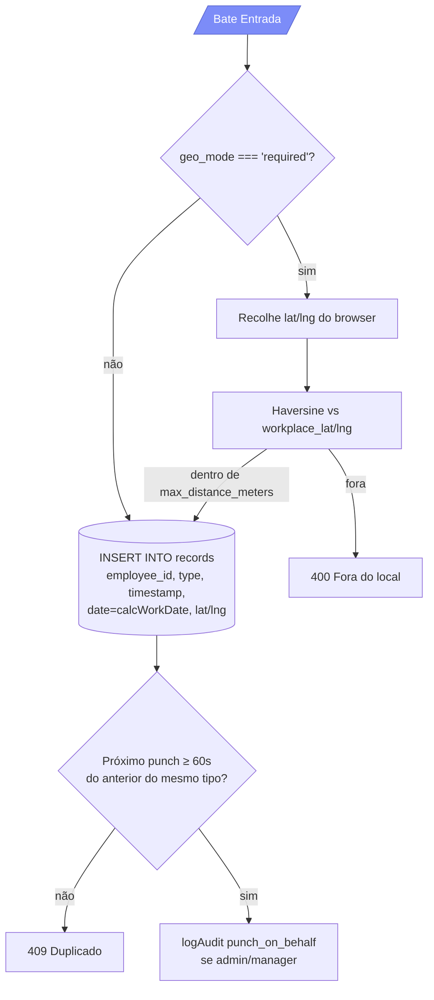

# Architecture

Visão técnica do PontoGlass — fluxos, camadas e decisões de design.

---

## Visão geral



- **Edge middleware** — valida apenas a assinatura do JWT (sem DB), redireciona não-autenticados para `/login`, encaminha por role (`admin`/`manager` → `/admin`, `employee` → `/ponto`).
- **API routes** — verificação completa via `verifyApiAuth` (sig + utilizador ativo + `sessions_valid_from` ≥ `iat` do token).
- **Supabase** — única fonte de verdade. As routes correm com a `service_role` key, RLS desativada por simplicidade (proteção é feita por role via middleware + apiAuth).
- **Vercel Cron** — endpoints `/api/cron/*` protegidos por `Bearer ${CRON_SECRET}`.

---

## Estrutura de pastas

```
app/
├─ page.tsx                    redirect inteligente (admin → /admin | employee → /ponto)
├─ login/page.tsx              split-screen (brand + form), 5 tentativas/15min
├─ admin/
│  ├─ page.tsx                 shell admin (sidebar + topbar + tabs)
│  ├─ _components/             Sidebar, TopBar, CommandPalette, NotificationsDropdown,
│  │                           SettingsModal, MissingExitBanner, tabs/*
│  └─ _lib/                    helpers (getWorkState, calcLiveMin, useNotifications)
├─ ponto/
│  ├─ page.tsx                 shell funcionário (fullscreen, 5 tabs)
│  └─ _components/CalendarView calendário mensal do histórico
├─ kiosk/page.tsx              modo quiosque (tablet partilhado, sem login individual)
└─ api/                        ver lista abaixo

lib/
├─ auth.ts                     createJWT / verifyJWT(WithMeta) / reset tokens
├─ apiAuth.ts                  verifyApiAuth (sig + active + sessions_valid_from)
├─ supabase.ts                 cliente único (service_role)
├─ rateLimit.ts                KV/Upstash + fallback em memória
├─ audit.ts                    helper para audit_logs
├─ email.ts                    Microsoft Graph (preferido) + SMTP fallback
├─ i18n.ts + LangContext       4 idiomas (PT-PT, PT-BR, EN, ES)
├─ types.ts                    Employee, PunchRecord, CorrectionRequest, AuditLog, etc.
└─ utils.ts                    calcHours / calcNetMinutes / fmtMinutes / exportCSV / exportPDF

middleware.ts                  edge: signature-only auth + role-based redirects
public/sw.js                   service worker (cache + web push)
vercel.json                    cron jobs (absence-check 09:00 + missing-exit 17:00 UTC)
supabase/
├─ schema.sql                  schema completo + migrações v1→v10 comentadas
└─ migrations/                 migrações datadas (geofencing, RLS, backfill, etc.)
```

---

## Autenticação

### Fluxo de login



### Fluxo por request (rota privada)



### Revogação

- **Logout** (`POST /api/auth/logout`): apaga cookie + `UPDATE employees SET sessions_valid_from = NOW()`. Todos os tokens com `iat < NOW` deixam de ser aceites.
- **Troca/reset de senha**: emite o mesmo `UPDATE` e re-emite o token (back-dated 2s) para o utilizador continuar logado.
- **Resiliência**: se a coluna `sessions_valid_from` ainda não existir (migração não aplicada), `verifyApiAuth` degrada para signature-only — não tranca ninguém.

### Tokens de reset de senha

- TTL: 1h.
- Claim `pwh` = SHA-256(password_hash atual) truncado a 16 hex → uso único (qualquer troca de senha invalida o link).

---

## Modelo de permissões (RBAC)

Três roles definidos em `employees.role`:

| Role     | Áreas | Pode |
|----------|-------|------|
| `employee` | `/ponto` | Bater ponto próprio, ver histórico/calendário, solicitar correções, ver banco de horas próprio |
| `manager`  | `/admin` (tabs OPERAÇÃO + PESSOAS – Funcionários + ANÁLISE – Auditoria) | Monitorizar status ao vivo, registar ponto por qualquer funcionário, aprovar/rejeitar correções, gerir banco de horas, gerir feriados, ver relatórios |
| `admin`    | `/admin` (todos os tabs) | Tudo do manager + CRUD de funcionários + audit log + reset de senha de outros + lock_profile |

Enforcement:
- **Edge middleware**: redireciona empregados para `/ponto`, admins para `/admin`.
- **Cada API route**: chama `verifyApiAuth` e valida `user.role` quando relevante (`if (!['admin','manager'].includes(user.role)) return 403`).

---

## Ciclo de registo de ponto



### Date stamping

`calcWorkDate(timestamp, shift_start)` devolve o "dia de trabalho" no fuso configurado (`NEXT_PUBLIC_BUSINESS_TZ`, padrão `Europe/Madrid`). Para turnos noturnos (`shift_start='22:00'`), uma entrada às 23:30 conta para o **dia da entrada**, não para o dia seguinte.

### Tipos de batida

- Trabalho: `entrada`, `fim_almoco`, `retorno_cafe` (qualquer destes a "abrir" sessão)
- Pausa: `inicio_almoco`, `pausa_cafe`
- Saída: `saída` (com acento)

### Cálculo de horas

- `calcTimeBreakdown(recs)` — usa pares explícitos de entrada/saída + inicio_almoco/fim_almoco + pausa_cafe/retorno_cafe.
- `calcLiveMin(recs, lunchAuto)` — para display em tempo real durante a jornada. Quando o trabalhador está em serviço, não pré-deduz `lunch_break_minutes` (mostra tempo bruto). Após `saída`, deduz como fallback para quem não regista pausas explícitas.
- `calcWorkedMinutesPeriod` / `calcOvertimePeriod` — para relatórios e payslip; calcula líquido com lunch deduzido quando o dia está fechado.

---

## API surface

```
/api/auth/
  ├─ login            POST  bcrypt + JWT + cookie + rate limit
  ├─ logout           POST  apaga cookie + revoga tokens (sessions_valid_from=NOW)
  ├─ password         PUT   troca de senha (re-emite token back-dated 2s)
  ├─ forgot-password  POST  envia link de reset (1h)
  ├─ reset-password   POST  valida token + redefine senha
  └─ recover          POST  reset de emergência via RECOVERY_SECRET (não-admins)

/api/me               GET   perfil completo (com fallback para colunas em falta)
                      PATCH theme / email

/api/punch            POST  regista batida (suporta on-behalf para admin/manager)

/api/records          GET   ?today=true | ?employeeId=X
                      POST  registar batida manual (admin)
/api/records/[id]     PATCH editar timestamp/comment
                      DELETE remover

/api/employees        GET   listar ativos
                      POST  criar (admin)
/api/employees/[id]   PATCH update (role, lock_profile, password, etc)
                      DELETE soft-delete (active=false)

/api/hour-bank        GET   ?employeeId=X (saldo + ajustes)
                      POST  novo ajuste manual
/api/hour-bank/[id]   DELETE remover ajuste

/api/correction-requests   GET/POST  listar + criar
/api/correction-requests/[id] PATCH  aprovar / rejeitar

/api/day-exceptions   GET/POST  feriados e folgas (global ou por funcionário)
/api/day-exceptions/[id] DELETE

/api/reports          GET   ?from=YYYY-MM-DD&to=YYYY-MM-DD (máx 366 dias, ≤ 2000 rows)
/api/audit            GET   logs (admin)
/api/push-subscribe   POST  guarda subscription VAPID do browser

/api/cron/
  ├─ absence-check    GET   09:00 UTC dias úteis (Vercel cron, Bearer CRON_SECRET)
  └─ missing-exit     GET   17:00 UTC dias úteis (Vercel cron, Bearer CRON_SECRET)
```

---

## Schema do banco

Ver `supabase/schema.sql` para o SQL completo. Tabelas principais:

```
employees                  perfil + role + horário + valor/h + tema + sessions_valid_from
records                    batida (employee_id, type, timestamp, date, lat/lng, comment)
hour_bank_adjustments      ajustes manuais (minutes signed + reason)
correction_requests        pedido de funcionário (status: pending|approved|rejected)
day_exceptions             feriados/folgas (global se employee_id NULL, senão por funcionário)
push_subscriptions         VAPID subscriptions por funcionário
audit_logs                 trilha de ações administrativas (JSONB details)
```

Versionamento:
- `supabase/schema.sql` — schema completo + migrações v1→v10 comentadas em ordem.
- `supabase/migrations/*.sql` — migrações datadas individuais (mais granulares). Idempotentes (`IF NOT EXISTS`).

---

## Frontend

### Design system

- CSS puro (sem Tailwind). `app/globals.css` define `--bg`, `--accent`, `--fg`, `--success-*`, `--danger-*`, etc. para temas `light` e `[data-theme="dark"]`.
- Componentes de layout: `.app[data-collapsed]`, `.sidebar`, `.topbar`, `.page`, `.page-head`, `.card`, `.kpi-grid`, `.status-row`, `.filter-bar`, `.filter-pill`, `.seg`, `.chip`.
- Avatares: `.avatar.size-22/28/30/36/48/64` + cor por hash do ID (`av-c1`...`av-c8`).
- Mobile: sidebar fica em drawer (≤768px), tabelas com `overflow-x: auto`, colunas com `data-col="X"` que são escondidas/encolhidas via media queries.

### Atalhos

- **⌘K / Ctrl+K** — abre Command Palette (navegação por teclado + ações rápidas)
- **Esc** — fecha modal / palette / drawer
- **Clicar no avatar** (admin sidebar / ponto topbar) — abre Settings Modal

### State management

Sem Redux/Zustand. State local com `useState`/`useEffect`. Padrões recorrentes:

- **Live data**: `useEffect` com `setInterval(load, 60_000)` + refetch em `focus` e no evento `pg:records-changed` (dispatched após cada POST/PATCH/DELETE de record).
- **Out-of-order responses**: `loadSeq` com `useRef` para ignorar respostas atrasadas de fetches anteriores.
- **Cleanup**: todos os intervals/listeners têm `return () => { ... }` no useEffect.

---

## i18n

`lib/i18n.ts` define `TRANSLATIONS: Record<Lang, Record<TranslationKey, string>>` com 4 idiomas (`pt-PT`, `pt-BR`, `en`, `es`). `LangContext` expõe `t(key)` e `setLang(l)`. A escolha persiste em `localStorage` (`pg.lang`).

A escolha inicial é detectada via `navigator.language` na primeira visita.

---

## Observabilidade

- **Sentry** (`sentry.client.config.ts` + `sentry.server.config.ts`) — captura erros cliente e servidor. Source maps via `withSentryConfig` no `next.config.mjs`.
- **Vercel Analytics** + **Speed Insights** — métricas de performance e tráfego.
- **Audit log** — toda a acção administrativa cria uma linha em `audit_logs` (criar/remover funcionário, ajustar banco de horas, aprovar correção, etc).

---

## Decisões notáveis

| Decisão | Motivo |
|---------|--------|
| JWT em httpOnly cookie | XSS-safe (JS não lê), funciona em SSR e API |
| Edge middleware só com signature | Latência mínima, sem DB hops por request |
| Verificação completa só nas API routes | Custo aceitável (já há query ao DB), permite revogação fina |
| Service role key só no servidor | Cliente nunca tem permissões diretas no DB |
| Sem RLS no Postgres | Simplicidade — proteção é centralizada nas API routes |
| Records.date no fuso local | Relatórios consistentes para a empresa, independente do fuso do servidor |
| Lunch deduction só após saída | Display ao vivo mostra tempo bruto (não confunde o trabalhador) |
| Soft delete de funcionários | Preserva histórico de records e audit logs |
| `.maybeSingle()` + fallback nas queries | Tolerância a migrações pendentes em produção |
