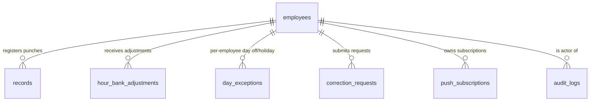

# Database schema

PontoGlass uses **PostgreSQL** via Supabase. The canonical DDL lives in
[`supabase/schema.sql`](../supabase/schema.sql) — run it once in the Supabase SQL
editor on a fresh project, and you're ready to start. Incremental migrations
sit in [`supabase/migrations/`](../supabase/migrations/).

This page is the human-readable reference: what each table is for, how the
columns relate, and which APIs touch them.

---

## ER overview

---

## `employees`

The core identity table. One row per person (admin, manager, or employee).

| Column                 | Type           | Notes                                                                                                              |
| ---------------------- | -------------- | ------------------------------------------------------------------------------------------------------------------ |
| `id`                   | `UUID` PK      | `gen_random_uuid()`                                                                                                |
| `name`                 | `TEXT`         | Display name                                                                                                       |
| `username`             | `TEXT` UNIQUE  | Login handle                                                                                                       |
| `password_hash`        | `TEXT`         | bcrypt hash (`$2b$…`)                                                                                              |
| `role`                 | `TEXT`         | `admin` / `manager` / `employee` (CHECK)                                                                           |
| `active`               | `BOOLEAN`      | Soft-disable                                                                                                       |
| `email`                | `TEXT`         | Optional, used for password reset                                                                                  |
| `workday_hours`        | `DECIMAL(4,2)` | Daily target hours                                                                                                 |
| `lunch_break_minutes`  | `INT`          | Auto-deducted from net minutes when no explicit lunch punch exists                                                 |
| `hourly_rate`          | `DECIMAL(10,2)`| Optional — drives earnings display                                                                                 |
| `geo_mode`             | `TEXT`         | `required` / `optional` / `disabled` (CHECK)                                                                       |
| `lock_profile`         | `BOOLEAN`      | Admin lock — employee can't change own password                                                                    |
| `expected_start`/`_end`| `TIME`         | Reference schedule, used for tardiness highlights                                                                  |
| `shift_start`          | `TIME`         | LOCAL business-tz boundary for "new workday" — `'00:00'` for day shifts, e.g. `'22:00'` for night shifts            |
| `sessions_valid_from`  | `TIMESTAMPTZ`  | Token revocation watermark: API rejects JWTs with `iat < sessions_valid_from`. Defaults to epoch so existing tokens survive the migration. |
| `theme`                | `TEXT`         | `dark` / `light` (per-user UI preference)                                                                          |
| `created_at`           | `TIMESTAMPTZ`  | `NOW()`                                                                                                            |

---

## `records`

Every punch the employee makes. Read paths: `/api/records`, `/api/reports`.

| Column          | Type           | Notes                                                                                  |
| --------------- | -------------- | -------------------------------------------------------------------------------------- |
| `id`            | `UUID` PK      | `gen_random_uuid()`                                                                    |
| `employee_id`   | `UUID` FK      | → `employees(id)`                                                                      |
| `employee_name` | `TEXT`         | Denormalised for reports that outlive the employee row                                 |
| `type`          | `TEXT`         | `entrada` / `saída` / `inicio_almoco` / `fim_almoco` / `pausa_cafe` / `retorno_cafe`   |
| `timestamp`     | `TIMESTAMPTZ`  | Real instant of the punch                                                              |
| `date`          | `DATE`         | Business-day bucket (respects `shift_start` for night shifts)                          |
| `latitude`      | `DECIMAL(9,6)` | Optional geolocation                                                                   |
| `longitude`     | `DECIMAL(9,6)` | Optional geolocation                                                                   |
| `comment`       | `TEXT`         | Optional reviewer/employee note                                                        |

Indexes: `(employee_id)`, `(date)`, `(employee_id, date)`.

---

## `hour_bank_adjustments`

Manual credits/debits to an employee's hour bank (e.g. comp-time grant).

| Column        | Type        | Notes                                |
| ------------- | ----------- | ------------------------------------ |
| `id`          | `UUID` PK   |                                      |
| `employee_id` | `UUID` FK   | → `employees(id)`                    |
| `minutes`     | `INTEGER`   | Positive = credit, negative = debit  |
| `reason`      | `TEXT`      | Required justification               |
| `date`        | `DATE`      | When the adjustment applies          |
| `created_by`  | `UUID` FK   | → `employees(id)` (the admin/manager)|
| `created_at`  | `TIMESTAMPTZ` |                                    |

Read path: `/api/hour-bank/[id]`, also surfaced in `/api/reports`.

---

## `day_exceptions`

Holidays, days off, and per-employee exceptions. Excluded from "absent" tallies.

| Column        | Type     | Notes                                                                       |
| ------------- | -------- | --------------------------------------------------------------------------- |
| `id`          | `UUID` PK|                                                                             |
| `date`        | `DATE`   | Required                                                                    |
| `type`        | `TEXT`   | `holiday` (company-wide) / `day_off` (employee-specific) (CHECK)            |
| `description` | `TEXT`   |                                                                             |
| `employee_id` | `UUID` FK| Optional — `NULL` = applies to everyone (holiday)                           |
| `created_by`  | `UUID` FK|                                                                             |
| `created_at`  | `TIMESTAMPTZ` |                                                                        |

Indexes: `(date)`, `(employee_id)`.

---

## `correction_requests`

Employee-submitted requests to add/fix a punch retroactively.

| Column          | Type        | Notes                                              |
| --------------- | ----------- | -------------------------------------------------- |
| `id`            | `UUID` PK   |                                                    |
| `employee_id`   | `UUID` FK   | `ON DELETE CASCADE`                                |
| `employee_name` | `TEXT`      | Denormalised                                       |
| `req_type`      | `TEXT`      | One of the 6 punch types (CHECK)                   |
| `req_timestamp` | `TIMESTAMPTZ` | The instant the employee claims                  |
| `req_date`      | `DATE`      | Business-day bucket                                |
| `reason`        | `TEXT`      | Optional employee note                             |
| `status`        | `TEXT`      | `pending` / `approved` / `rejected` (CHECK)        |
| `reviewer_id`   | `UUID` FK   | Admin/manager who resolved it                      |
| `reviewer_name` | `TEXT`      |                                                    |
| `reviewer_note` | `TEXT`      | Optional rejection reason                          |
| `created_at`    | `TIMESTAMPTZ` |                                                  |
| `resolved_at`   | `TIMESTAMPTZ` | `NULL` while pending                             |

When `approved`, a new row is inserted into `records` with the requested
timestamp.

---

## `audit_logs`

Append-only audit trail of every privileged action (login attempts excluded).

| Column        | Type     | Notes                                            |
| ------------- | -------- | ------------------------------------------------ |
| `id`          | `UUID` PK|                                                  |
| `actor_id`    | `UUID` FK| Who did it                                       |
| `actor_name`  | `TEXT`   | Denormalised (actor may be soft-deleted later)   |
| `action`      | `TEXT`   | e.g. `employee.create`, `record.delete`          |
| `target_id`   | `UUID`   | Resource affected (employee, record, …)          |
| `target_name` | `TEXT`   |                                                  |
| `details`     | `JSONB`  | Free-form before/after diff                      |
| `created_at`  | `TIMESTAMPTZ` |                                             |

Indexes: `(created_at DESC)`, `(action)`.

---

## `push_subscriptions`

Web Push subscriptions (one row per device/browser).

See [`supabase/migrations/20260522_push_subscriptions.sql`](../supabase/migrations/20260522_push_subscriptions.sql).

---

## Row-Level Security (RLS)

RLS is enabled on `employees` and `records`. The application uses the
**service-role key** server-side (which bypasses RLS), and the API enforces
authorization via JWT claims (`role`) before issuing queries. So the RLS
policies are a defense-in-depth net — not the primary access control. See
[`supabase/migrations/20260528_rls_policies.sql`](../supabase/migrations/20260528_rls_policies.sql).

---

## Bootstrap

On first request, if no admin exists, the API auto-creates one from
`INITIAL_ADMIN_USERNAME` / `INITIAL_ADMIN_PASSWORD`. **Change the password
right after the first login.**

---

## Time zone notes

- `timestamp` columns are `TIMESTAMPTZ` — always stored in UTC
- `date` columns are *business-tz* days (`NEXT_PUBLIC_BUSINESS_TZ`, default `Europe/Madrid`)
- For night-shift employees, `shift_start` shifts the business-day boundary
  (e.g. `'22:00'` means a punch at 23:30 local belongs to *that* calendar
  day, not the next morning)
- See `lib/utils.ts::businessDate()` and `calcWorkDate()` for the
  client-side equivalents
